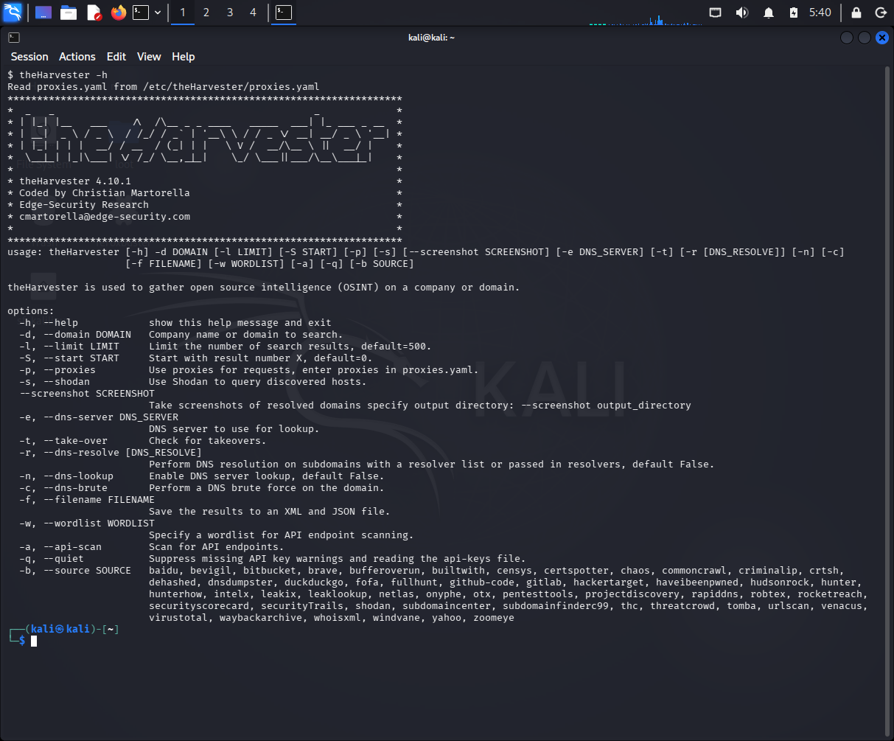
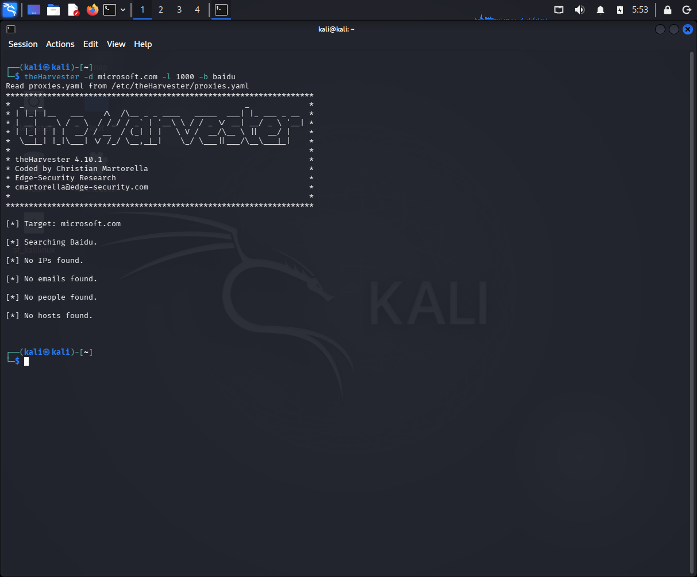
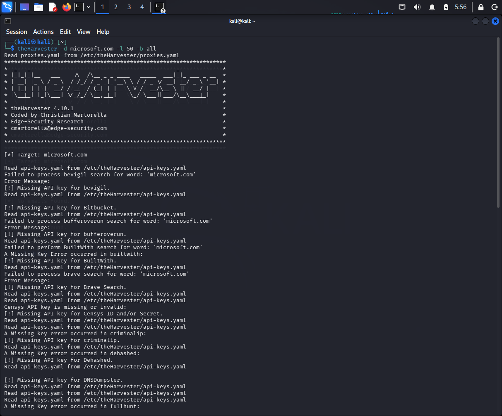

# NETWORKWALKS-B083-WK2-Footprinting-with-theHarvester


This project module focused on passive footprinting and reconnaissance using theHarvester in Kali Linux. 

### Footprinting & Reconnaissance with theHarvester

**W2-PM4 | Cybersecurity | Networkwalks**

| Project Information | Details |
| ------------------- | ------- |
| **Author** | Debashree Sinha |
| **Program / Batch** | B083 – Networkwalks |
| **Date** | 21 September 2026 |
| **Module Completed** | W2-PM4 — Footprinting & Reconnaissance with theHarvester |
| **Target** | `microsoft.com` |
| **Operating System** | Kali Linux |
| **Tool Used** | theHarvester v4.10.1 |
| **Assessment Type** | Passive Footprinting & Reconnaissance |
| **Current Status** | Module Completed |

---

## Table of Contents

1. [Liability Disclaimer](#1-liability-disclaimer)
2. [Introduction](#2-introduction)
3. [Tools & Environment](#3-tools--environment)
4. [Objectives](#4-objectives)
5. [Activities Performed](#5-activities-performed)
   - [5.1 Baidu-Based Reconnaissance](#51-baidu-based-reconnaissance)
   - [5.2 Multi-Source Reconnaissance](#52-multi-source-reconnaissance)
6. [Analysis / Impact](#6-analysis--impact)
7. [Conclusion](#7-conclusion)
8. [Evidences Collected](#8-evidences-collected)

---

# 1. Liability Disclaimer

This practical activity was performed as part of the Networkwalks cybersecurity training module for educational purposes.

The reconnaissance techniques demonstrated in this report should only be performed against systems, domains, or networks where appropriate authorization and scope have been established.

Unauthorized reconnaissance, scanning, or access may have legal and security consequences. The information documented here is intended for cybersecurity learning and defensive understanding.

---

# 2. Introduction

This report documents the practical work completed during **Week 2 – Project Module 4** of the Networkwalks cybersecurity training program.

The module focused on **footprinting and passive reconnaissance using theHarvester**, a tool designed to collect publicly available information associated with a target domain from various data sources.

The assigned target for this activity was:

```text
microsoft.com
```

The exercise involved performing two reconnaissance searches: one through **Baidu** with a result limit of 1000 and another using **all available sources** with a result limit of 50.

The purpose of the activity was to understand how publicly available information such as hosts, sub-domains, IP addresses, ASNs, and other infrastructure-related details can contribute to an organization's external digital footprint.

---

# 3. Tools & Environment

| Tool / Environment | Purpose |
| ------------------ | ------- |
| **Kali Linux** | Operating system used for the reconnaissance activity. |
| **theHarvester v4.10.1** | Passive information-gathering and footprinting tool. |
| **Baidu** | Public search source used during the first reconnaissance activity. |
| **Multiple Public Sources** | Data sources queried during the second reconnaissance activity. |

TheHarvester was executed directly from the Kali Linux terminal.

---

# 4. Objectives

The primary objectives of this practical were:

- Perform passive footprinting against the assigned target domain.
- Use theHarvester to gather publicly available information.
- Identify hosts, sub-domains, IP addresses, and related infrastructure information.
- Compare results obtained from a single source with results obtained from multiple sources.
- Understand the importance of publicly exposed information during the reconnaissance phase of a security assessment.

---

# 5. Activities Performed

## 5.1 Baidu-Based Reconnaissance

The first activity used **Baidu** as the data source with a result limit of 1000.

### Command Used

```bash
theHarvester -d microsoft.com -l 1000 -b baidu
```

Where:

| Parameter | Meaning |
| --------- | ------- |
| `-d` | Specifies the target domain. |
| `-l` | Sets the result limit. |
| `-b` | Specifies the data source. |

### Result

TheHarvester successfully initiated the search against `microsoft.com`, but the Baidu search returned no results for the following categories:

| Category | Result |
| -------- | ------ |
| **IPs** | None found |
| **Emails** | None found |
| **People** | None found |
| **Hosts** | None found |

The result demonstrates that an individual public source may provide little or no usable information for a particular target at the time of testing.

---

## 5.2 Multi-Source Reconnaissance

The second activity used theHarvester with all available sources and a result limit of 50.

### Command Used

```bash
theHarvester -d microsoft.com -l 50 -b all
```

TheHarvester attempted to query a wide range of publicly available sources.

Several sources could not be processed because they required API keys or authentication. Despite these limitations, the tool successfully collected a substantial amount of information from the available sources.

### Key Results

| Information Category | Result |
| --------------------- | ------ |
| **IP Addresses** | 140 |
| **Hosts** | 9,963 |
| **ASNs** | 8 |
| **Interesting URLs** | 2 |
| **Emails** | 0 |
| **People** | 0 |
| **LinkedIn Users** | 0 |
| **Sub-domains via DNS fallback** | 14 |

### Autonomous System Numbers

The scan identified the following ASNs:

```text
AS13335
AS133618
AS206834
AS209242
AS20940
AS22489
AS40034
AS8075
```

### Interesting URLs

Two interesting URLs were identified during the reconnaissance:

```text
https://news.microsoft.com/source/
https://www.microsoft.com/es-es/privacy/privacystatement
```

### Additional Observation

The tool also reported:

```text
Extracted 43 hosts from employee URLs
```

through the Hudson Rock source, although no emails or IPs were returned by that source.

The multi-source scan also used a DNS fallback mechanism and reported:

```text
Found 14 subdomains using DNS fallback
```

---

# 6. Analysis / Impact

The reconnaissance activity demonstrated that the amount of publicly discoverable information can vary significantly depending on the data source being used.

The Baidu-only search produced no IPs, emails, people, or hosts, while the multi-source search produced a considerably larger dataset, including **140 IP addresses and 9,963 hosts**.

This highlights the value of using multiple publicly available sources during passive reconnaissance. At the same time, the results showed that some sources require API credentials, meaning the amount of information available to the tool depends partly on source accessibility and configuration.

From a security perspective, publicly discoverable hosts, IP addresses, and sub-domains can contribute to an organization's external attack surface. Such information can be useful to security teams when performing defensive exposure assessments and identifying what information is visible from outside the organization.

No email addresses or people were identified in the final results, and this activity did not involve exploitation or direct access to the target.

---

# 7. Conclusion

This practical provided hands-on experience with **theHarvester and passive footprinting** in Kali Linux.

I performed reconnaissance against `microsoft.com` using both Baidu and multiple available sources. The results demonstrated the difference between relying on a single source and combining information from multiple public sources.

The activity resulted in the identification of **140 IP addresses, 9,963 hosts, 8 ASNs, 2 interesting URLs, and 14 sub-domains through DNS fallback**, while no emails or people were identified.

The exercise helped me understand how passive reconnaissance can provide a broad view of an organization's publicly visible infrastructure without directly interacting with its systems.

It also reinforced the importance of reviewing publicly exposed information from a defensive cybersecurity perspective.

---

# 8. Evidences Collected




---

## Author

### Debashree Sinha

**Cybersecurity Learner | Building Strong Foundations in Networking, Linux & Python**

[LinkedIn](https://www.linkedin.com/in/debashrees)
---

## Project Information

| | |
| --- | --- |
| **Program** | Networkwalks Cybersecurity Internship |
| **Week** | 02 |
| **Project Module** | W2-PM4 |
| **Module** | Footprinting & Reconnaissance with theHarvester |
| **Target** | `microsoft.com` |
| **Focus** | Passive Reconnaissance & Information Gathering |

---

### Disclaimer

This repository is intended for educational and documentation purposes. The techniques demonstrated should only be used against systems, domains, and networks for which appropriate authorization has been obtained.
